# Athena

Athena is a self-hosted application for journaling and archiving. It keeps your
notes, tasks, and ideas in a single library that you run and control. One Go
server hosts the library and serves a web client on the same origin. An optional
desktop app is also available.

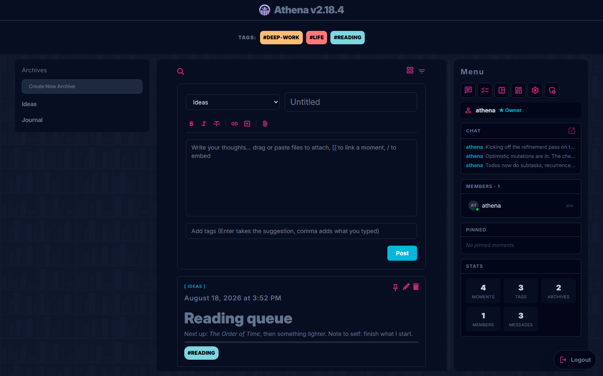

<sub>Legacy theme, Legacy look</sub>

## Features

- **Moments.** Notes with a title, a Markdown body, colored tags, and file
  attachments (images, PDFs, audio, and video preview inline). Moments are
  grouped into archives, with full-text search, filtering by date and media,
  pinning, and links between moments.
- **Tasks.** A board of lists with due dates, priorities, subtasks, recurring
  items, and an optional link to a related moment. An agenda view collects
  everything due across every list onto one timeline. Daily lists roll unfinished
  items into the next day.
- **Canvas.** An infinite pan-and-zoom board with sticky notes, text labels,
  shapes, images, web links, moment references, and live todo embeds, joined by
  connectors.
- **Chat.** A library-wide message log that renders the same formatting and
  embeds as moments, with inline edit and delete.
- **Appearance.** Eleven color themes plus a custom theme editor, six "Look"
  presets that change surfaces and typography, and layout options.
- **Administration.** Invite links and codes with optional expiry, roles with
  per-permission control, an audit log, and scheduled or on-demand backups.
- **Clients.** A browser PWA that installs to mobile, and a desktop app that can
  manage several servers at once.

Data stays on your server. There is no external account and no third-party
service.

## Demos

Recorded from the running app, not mocked up.

| Themes and looks |
| --- |
| 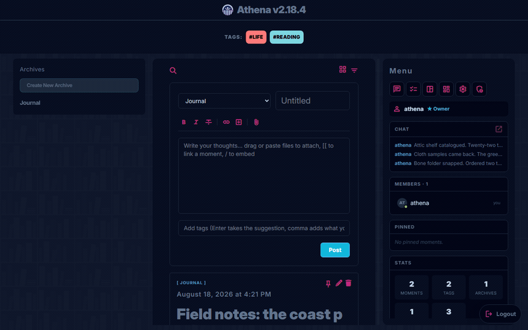 |
| The same feed under seven theme and look pairings. A theme sets the palette, a look sets surfaces, typography and shape, and the two compose freely. |

| To-do board |
| --- |
| 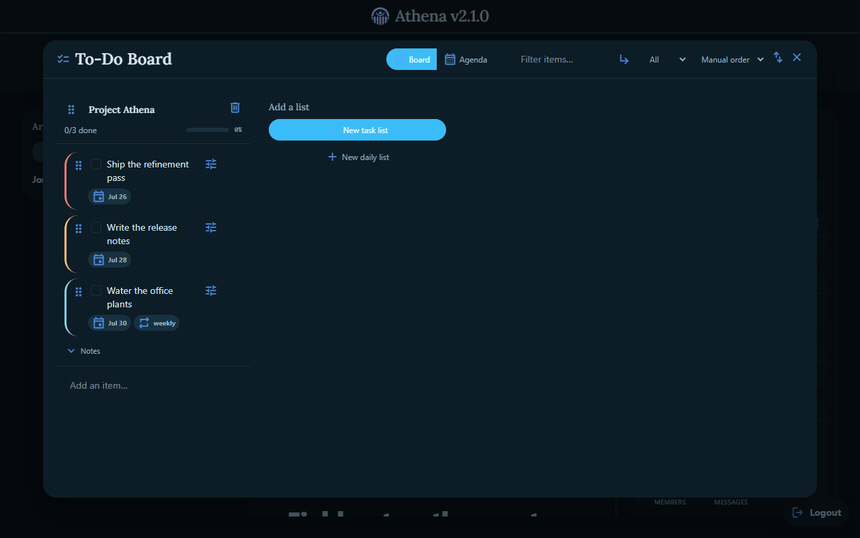 |
| Checking items off a task list, then switching to the agenda, which collects what is still due across every list. Ocean theme, Slate-soft look. |

## Screenshots

No two shots below use the same appearance. Each one names the theme and look
it was captured under, so the gallery doubles as a tour of what the appearance
system does. Nothing else differs between them: it is the same library, the
same content, and the same build throughout.

| To-do board | Agenda |
| --- | --- |
| 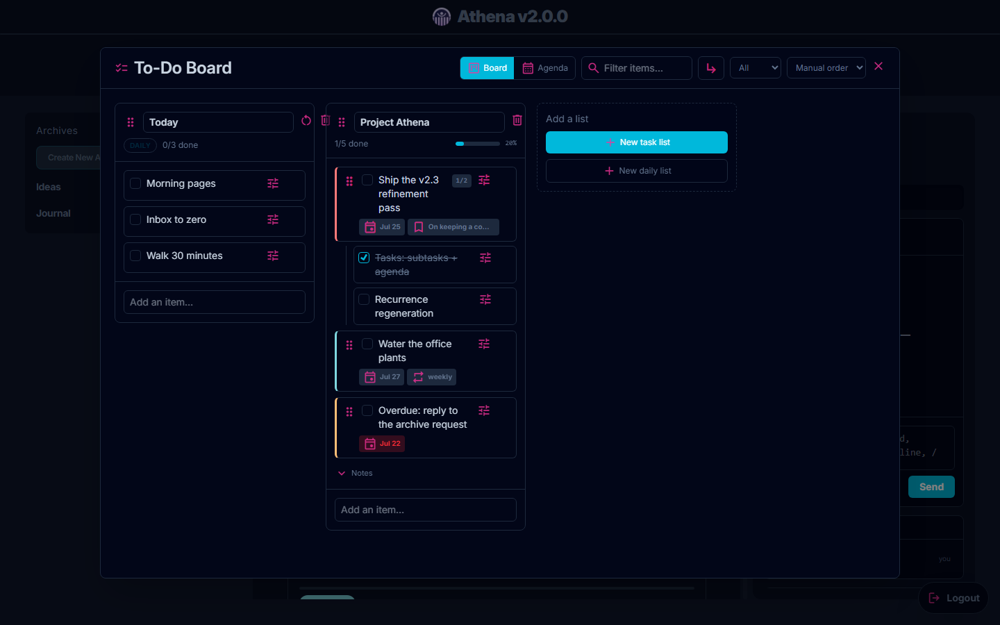<br><sub>Ocean theme, Slate-soft look</sub> | 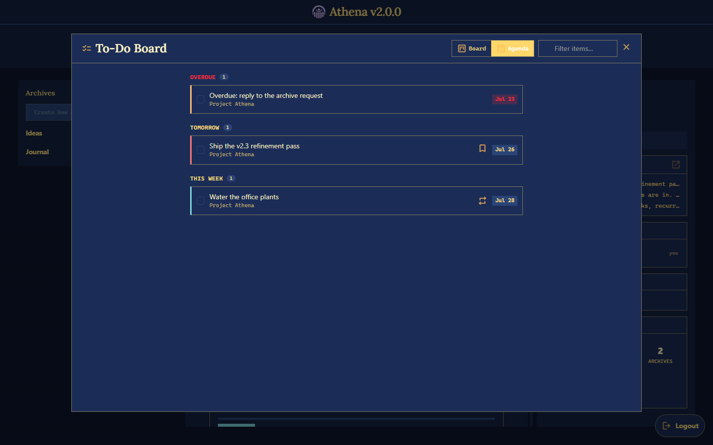<br><sub>Royal Blue theme, Ink look</sub> |

| Canvas | Chat |
| --- | --- |
| 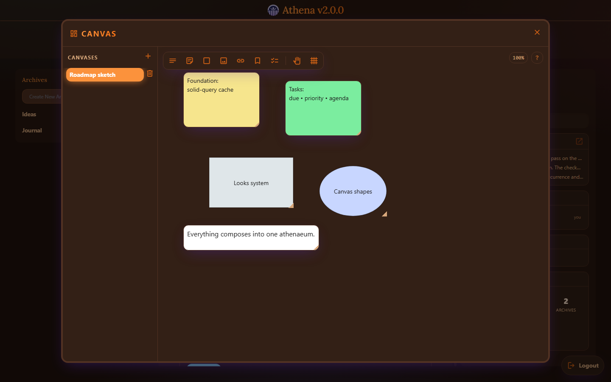<br><sub>Sunset theme, Aurora look</sub> | 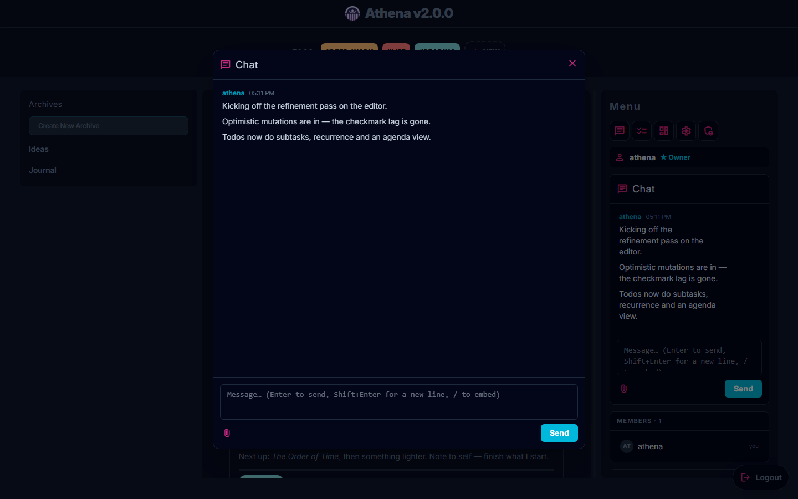<br><sub>Arctic theme, Slate-soft look</sub> |

| Focused reader | Appearance settings |
| --- | --- |
| 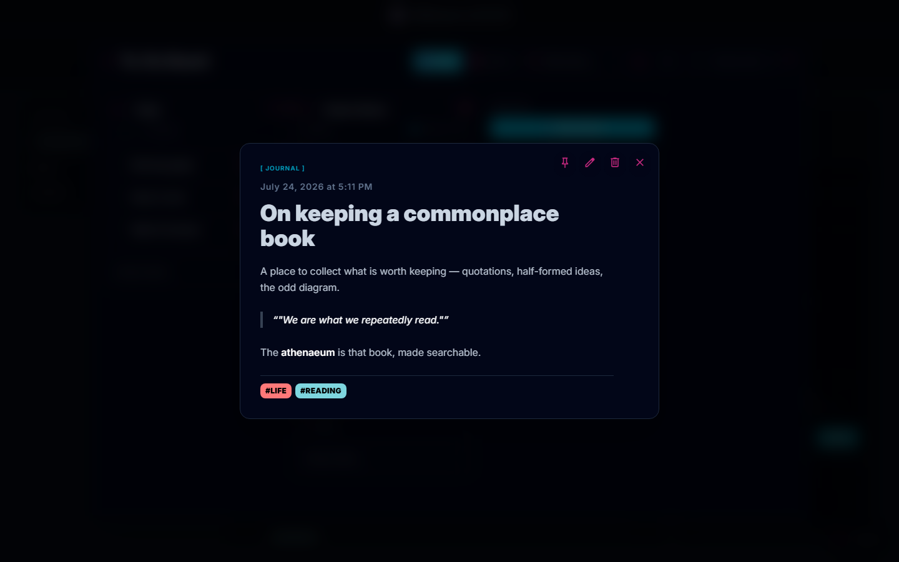<br><sub>Neutral theme, Editorial look</sub> | 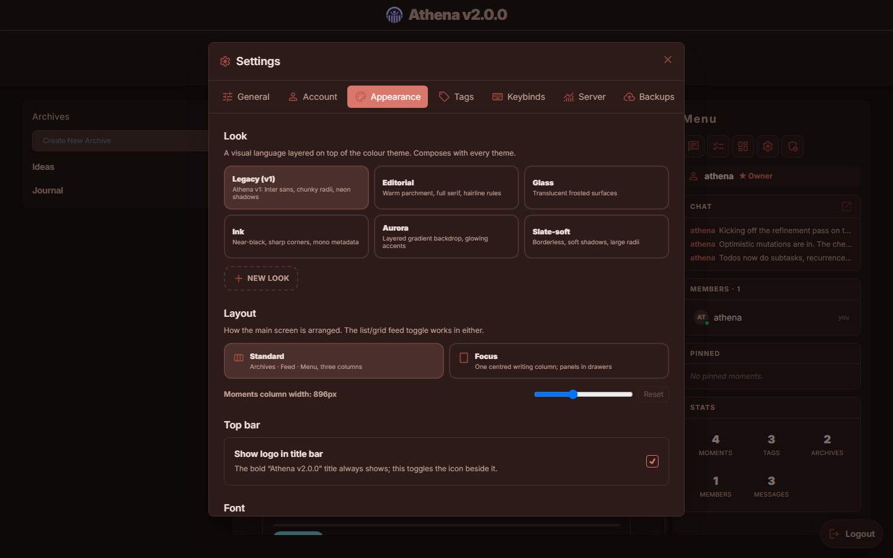<br><sub>Rosewood theme, Legacy look</sub> |

The web client is a PWA and installs to a phone. On mobile, moments read one
at a time as swipeable cards, draggable anywhere on the card and not just the
edges, with neighbouring cards peeking in. A bottom nav (Archives, Filter,
New, Chat, More) replaces the desktop tag bar and side menu with sheets that
slide up over the feed, and long-pressing a card, message, or canvas node
opens its actions (edit, delete, pin) as a touch-friendly action sheet. Themes
and looks are not a desktop-only feature, so these are themed separately again:

| Mobile feed | Mobile filter | Mobile chat |
| --- | --- | --- |
| 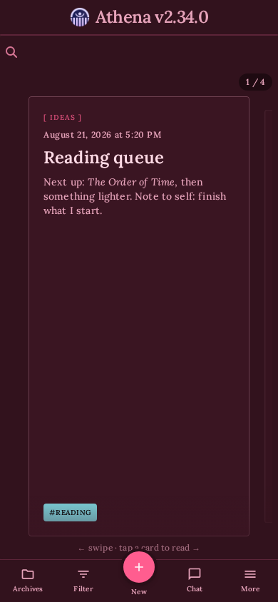<br><sub>Valentine theme, Editorial look</sub> | 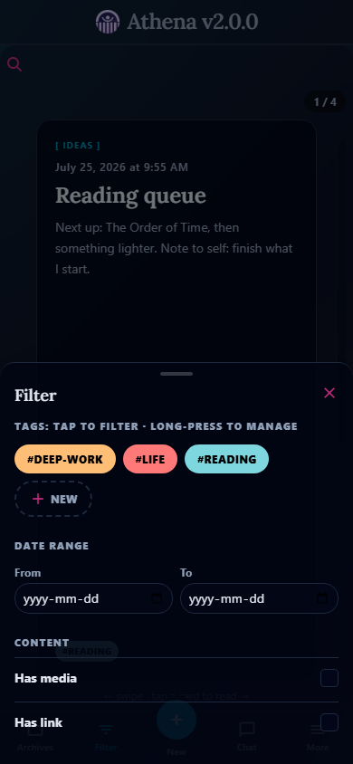<br><sub>Dark theme, Glass look</sub> | 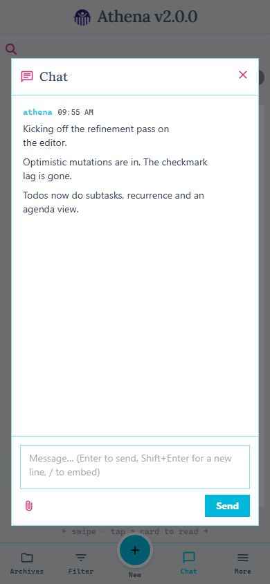<br><sub>Light theme, Ink look</sub> |

### Looks and themes

A **theme** sets the colour palette. A **look** sets surfaces, typography, and
shape. The two are independent, so any look composes with any theme, and both
ship with an editor for making your own.

| Look | Treatment | Seen above in |
| --- | --- | --- |
| Legacy | Inter sans, chunky radii, neon shadows | Feed, appearance settings |
| Editorial | Warm parchment, full serif, hairline rules | Focused reader, mobile feed |
| Glass | Translucent frosted surfaces | Mobile filter |
| Ink | Near-black, sharp corners, mono metadata | Agenda, mobile chat |
| Aurora | Layered gradient backdrop, glowing accents | Canvas |
| Slate-soft | Borderless, soft shadows, large radii | To-do board, chat |

Eleven themes ship: Legacy, Dark, Light, Neutral, Rose, Valentine, Ocean, Royal
Blue, Sunset, Arctic, and Rosewood. Nine of them appear in the screenshots
above. A custom theme exports as a single shareable string, and a theme can be
pinned per archive so a given archive always opens in its own colours.

## Getting started

Requirements: Node.js 20 or newer and Go 1.25 or newer.

```bash
git clone https://github.com/athenaeum-app/athena-dev.git && cd athena-dev
npm install
npm run dev
```

`npm run dev` starts the Go server, the client with hot reload, and the desktop
launcher together. The first account you create becomes the owner and names the
library; everyone else joins by invitation from the admin panel.

To run in a browser instead of the desktop app, use `npm run dev:web` and open
the address it prints.

### Demo library

To see Athena populated instead of starting from an empty library, run:

```bash
npm run demo
```

This wipes any existing data and seeds a rich, deterministic demo library through
the real domain layer (moments, tasks, a canvas board, and chat), driven through
the same code paths the app itself uses, so every mutation produces authentic
sync events and audit entries. It covers every attachment type (images, PDF,
audio, animated GIF, and a generic file), pinned and legacy-badged content, and
active/expired/used invites. The command prints a login for five personas
spanning every role:

| Username | Password | Role | Email |
| --- | --- | --- | --- |
| `athena` | `demo-owner-2026` | Owner | owner@demo.athena |
| `ada_admin` | `demo-admin-2026` | Admin | admin@demo.athena |
| `eli_editor` | `demo-editor-2026` | Editor | editor@demo.athena |
| `mia_member` | `demo-member-2026` | Member | member@demo.athena |
| `vic_viewer` | `demo-viewer-2026` | Viewer | viewer@demo.athena |

These credentials are published here on purpose and are meant for local
evaluation only. `npm run demo` destroys the existing database, so never point it
at a server holding real data, and never expose a demo-seeded server to a
network.

| Login | Demo feed |
| --- | --- |
| 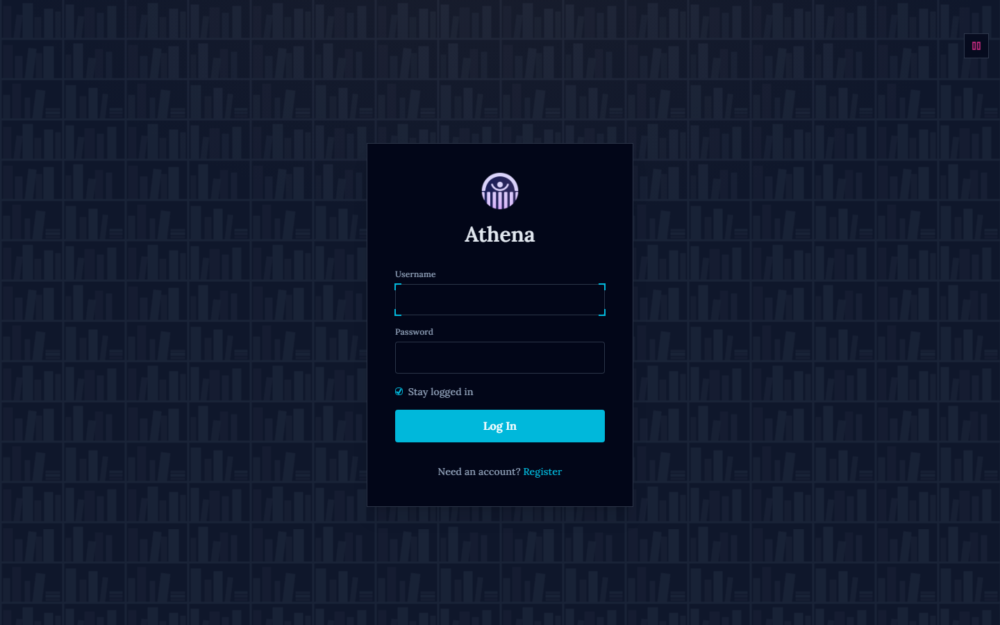 | 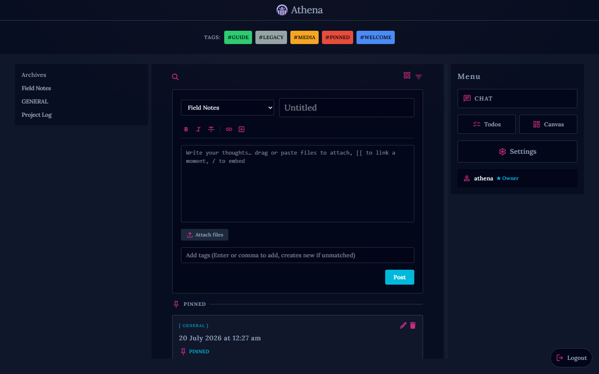 |

## Keyboard shortcuts

| Shortcut | Action |
| --- | --- |
| `Ctrl+M` | New moment |
| `Ctrl+F` | Focus search |
| `Ctrl+/` | Open chat |
| `Ctrl+,` | Open settings |
| `Ctrl+S` | Save the moment being edited |
| `Escape` | Close the top dialog |

Shortcuts can be rebound in Settings, under Keybinds.

## Self-hosting

Athena ships as a single container. The image contains the Go server with the
web client compiled into it, so there is nothing else to run and no separate
frontend to deploy.

Grab [`docker-compose.yml`](docker-compose.yml) from a checkout of the repo and start it:

```bash
docker compose up -d
```

Open `http://<host>:8080`. The first account you register becomes the owner.
Everyone else joins by invitation from the admin panel.

Updates apply themselves. The compose file includes a Watchtower service that
checks hourly for a newer image and restarts the server into it, leaving your
data untouched. Delete that service if you would rather do it by hand:

```bash
docker compose pull && docker compose up -d
```

To run an unreleased change, build from a checkout instead:

```bash
docker compose -f docker-compose.yml -f docker-compose.build.yml up -d --build
```

### Data

Everything lives in `./data`, bind-mounted into the container:

| Path | What it is |
| --- | --- |
| `data/athenaeum.db` | SQLite database: moments, tags, users, roles, chat |
| `data/uploads/` | Uploaded images, video, audio, and documents |
| `data/backups/` | Automated database snapshots |
| `data/athena.config.json` | Runtime settings written by the Settings UI |

Back up that one directory and you have backed up the library. Athena also
takes its own scheduled snapshots into `data/backups/`, which you can download
or restore from Settings.

### Configuration

All optional. The defaults are what the compose file ships with.

| Variable | Default | Meaning |
| --- | --- | --- |
| `PORT` | `8080` | Port the server listens on |
| `SESSION_EXPIRY_DAYS` | `30` | Days a login stays valid. `0` never expires |
| `PRUNE_AFTER_DAYS` | `365` | Age at which soft-deleted content is purged |
| `BACKUP_INTERVAL` | `24h` | Go duration between backups. `0` disables them |
| `BACKUP_RETENTION` | `7` | How many backups to keep |
| `PREVIEW_CACHE_TTL_HOURS` | `168` | Hours a scraped link preview is cached |
| `MAX_UPLOAD_MB` | `50` | Largest single upload accepted |
| `DB_PATH` | `/app/data/athenaeum.db` | Database location |
| `UPLOADS_PATH` | `/app/data/uploads` | Upload directory |

Backup settings can also be changed in Settings, which writes them to
`data/athena.config.json`. Environment variables win over that file.

### Behind a reverse proxy

Athena serves plain HTTP and expects something in front of it to terminate TLS.
Session cookies are marked `Secure` only when the Go server itself sees a TLS
connection, so behind a terminating proxy they will not carry that flag. They
remain `HttpOnly` with `SameSite=Lax`. Forward the `Host` header so generated
URLs stay correct.

## Development

Athena is a SolidJS PWA (TypeScript, Tailwind) served by a Go server with SQLite,
plus an Electron launcher. Authentication uses same-origin session cookies, and
live updates come from delta-sync polling.

```
athena/
├── server/     Go backend (HTTP API, SQLite, migrations, embedded PWA)
├── client/     SolidJS PWA (built into server/client/web and embedded)
├── shared/     OpenAPI spec and generated TypeScript types
├── electron/   Multi-server desktop launcher
└── docs/       Glossary, ADRs, and screenshots
```

Commands run from the repository root, which delegates into each sub-project.

| Command | Description |
| --- | --- |
| `npm run dev` | Full stack: Go API, client hot reload, and Electron |
| `npm run dev:web` | Client dev server only (open in a browser) |
| `npm run dev:server` | Go API only, on port 8080 |
| `npm run demo` | Wipe existing data and seed a rich demo library |
| `npm run build` | Build the desktop installer with electron-builder |
| `npm run build:dir` | Unpacked desktop app, no installer |
| `npm run build:client` | Build the PWA into `server/client/web` |
| `npm run build:server` | `go build ./...` |
| `npm test` | Client unit tests and `go test ./...` |
| `npm run typecheck` | `tsc --noEmit` over the client |
| `npm run e2e` | Playwright end-to-end tests |
| `cd client && npm run screenshots` | Regenerate the README screenshots |
| `cd client && npm run demos` | Regenerate the README demo GIFs (needs ffmpeg) |

The screenshots are produced from the running app. A Playwright script
([`client/e2e/screenshots.spec.ts`](client/e2e/screenshots.spec.ts)) starts a
fresh server, seeds sample content over the REST API, and captures each surface
into `docs/screenshots/`. It also sets a different theme and look before each
capture; those pairings are named in the captions above, so changing one in the
script means changing the matching caption here.

The demo GIFs come from a sibling script
([`client/e2e/demos.spec.ts`](client/e2e/demos.spec.ts)), which captures PNG
frames the same way and hands them to ffmpeg for a two-pass palette encode into
`docs/demos/`. ffmpeg has to be on `PATH`; without it the script skips rather
than failing the suite. GIF caps out at 256 colours and stores whole frames, so
the clips are deliberately short and mostly static: continuous motion such as
panning the canvas repaints every pixel of every frame and multiplies the file
size for it.

A few things to know before making changes:

- `vite build` writes the client into `server/client/web/`, which the Go binary
  embeds at compile time. Rebuild the server after building the client for
  changes to take effect.
- The client build is what the server serves; there is no separately hosted
  frontend.
- See [`docs/GLOSSARY.md`](docs/GLOSSARY.md) for the domain glossary and
  [`docs/adr/`](docs/adr) for the architectural decisions, including one server
  per library, the web and desktop capability split, and the embeddable modules.

## Status

Version 2 rewrite, under active development.

## Contributing

Bug reports and pull requests are welcome. See
[CONTRIBUTING.md](CONTRIBUTING.md) for how to build, test, and submit changes,
and [SECURITY.md](SECURITY.md) to report a vulnerability privately.

## License

[AGPL-3.0-only](LICENSE). Athena is software you reach over a network, so the
Affero clause is the point: if you run a modified version and let other people
use it, they are entitled to your changes.
