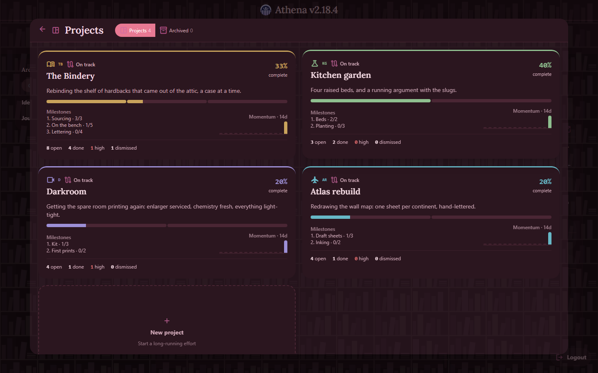
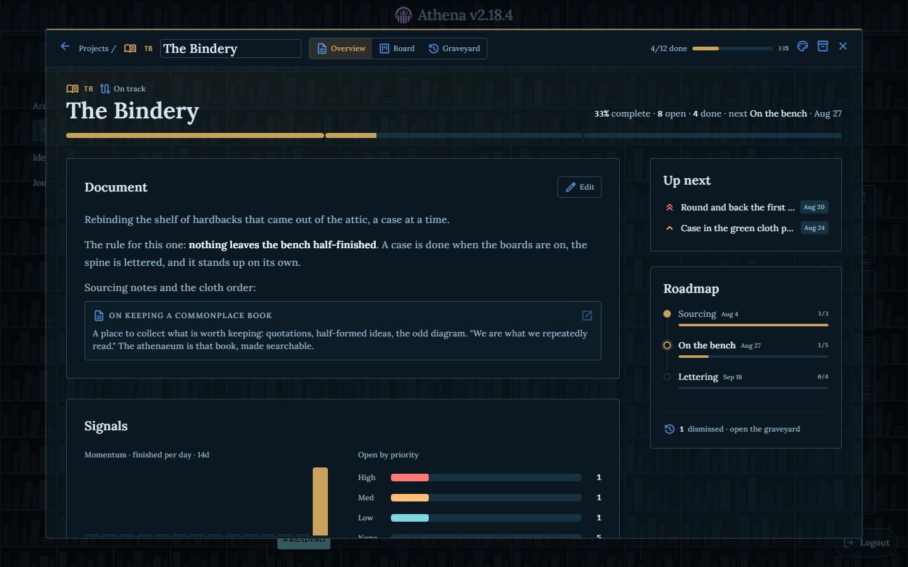
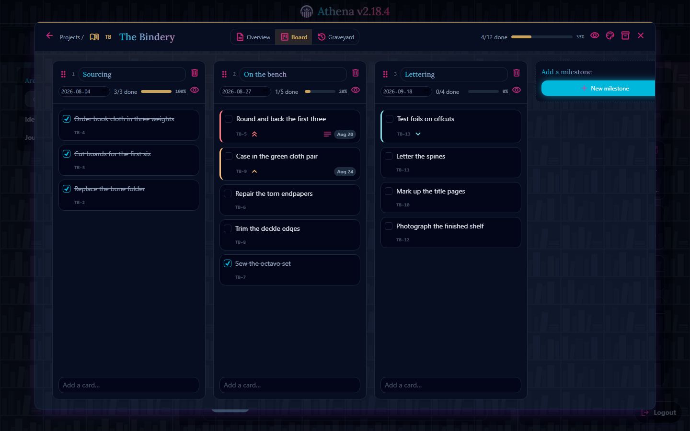

# Athena

Athena is a self-hosted application for journaling and archiving. Notes, tasks,
and ideas live in one library that you run and control: a Go server that hosts
it and serves the web client on the same origin, plus a desktop app that can
manage several servers at once. No external account, no third-party service.


<sub>Legacy theme, Legacy look</sub>

## Features

- **Moments.** Notes with a title, a Markdown body, colored tags, and file
  attachments (images, PDFs, audio, and video preview inline). Grouped into
  archives, with full-text search, filtering by date and media, pinning, and
  links between moments.
- **Tasks.** Lists with due dates, priorities, subtasks, and recurring items.
  An agenda view collects everything due across every list onto one timeline,
  and daily lists roll unfinished items into the next day.
- **Projects.** Long-horizon efforts, each a cover on a portfolio that opens
  into its own hub: an overview document with progress signals, a milestone
  board, and a graveyard that keeps dismissed cards recoverable. Overviews and
  cards use the same editor as moments, and a project embeds anywhere as a
  live summary card.
- **Canvas.** An infinite pan-and-zoom board with sticky notes, text, shapes,
  images, links, moment references, and live todo embeds, joined by connectors.
- **Chat.** A library-wide message log with the same formatting and embeds as
  moments.
- **Appearance.** Eleven color themes and six "Look" presets that compose
  freely, both with editors for making your own.
- **Administration.** Invite links with optional expiry, roles with
  per-permission control, an audit log, and scheduled backups.
- **Clients.** A browser PWA that installs to mobile, and a desktop app for
  Windows, macOS, and Linux.

## Screenshots

Same library, same build, a different theme and look in each, named below it.

| Themes and looks | Tasks and agenda |
| --- | --- |
|  |  |

| Projects portfolio | Project overview |
| --- | --- |
| <br><sub>Rose theme, Slate-soft look</sub> | <br><sub>Ocean theme, Editorial look</sub> |

| Milestone board | To-do board |
| --- | --- |
| <br><sub>Dark theme, Aurora look</sub> | <br><sub>Ocean theme, Slate-soft look</sub> |

| Canvas | Chat |
| --- | --- |
| <br><sub>Sunset theme, Aurora look</sub> | <br><sub>Arctic theme, Slate-soft look</sub> |

| Focused reader | Agenda |
| --- | --- |
| <br><sub>Neutral theme, Editorial look</sub> | <br><sub>Royal Blue theme, Ink look</sub> |

On mobile, moments read one at a time as swipeable cards, and a bottom nav
replaces the tag bar and side menu with sheets that slide up over the feed.

| Mobile feed | Mobile filter | Mobile chat |
| --- | --- | --- |
| <br><sub>Valentine theme, Editorial look</sub> | <br><sub>Dark theme, Glass look</sub> | <br><sub>Light theme, Ink look</sub> |

A theme sets the palette; a look sets surfaces, typography, and shape. Themes
ship as Legacy, Dark, Light, Neutral, Rose, Valentine, Ocean, Royal Blue,
Sunset, Arctic, and Rosewood; looks as Legacy, Editorial, Glass, Ink, Aurora,
and Slate-soft. A custom theme exports as one shareable string, and a theme can
be pinned per archive.

## Getting started

Requirements: Node.js 20 or newer and Go 1.25 or newer.

```bash
git clone https://github.com/athenaeum-app/athena-dev.git && cd athena-dev
npm install
npm run dev
```

`npm run dev` starts the Go server, the client with hot reload, and the desktop
launcher together; `npm run dev:web` runs the client alone in a browser. The
first account you create becomes the owner and names the library.

### Demo library

`npm run demo` wipes the database and seeds a full library through the real
domain layer, so the sync events and audit entries are the genuine article. It
covers every attachment type, pinned and legacy content, and active, expired,
and used invites, under five personas spanning the roles:

| Username | Password | Role |
| --- | --- | --- |
| `athena` | `demo-owner-2026` | Owner |
| `ada_admin` | `demo-admin-2026` | Admin |
| `eli_editor` | `demo-editor-2026` | Editor |
| `mia_member` | `demo-member-2026` | Member |
| `vic_viewer` | `demo-viewer-2026` | Viewer |

Local evaluation only. It destroys the existing database, so never point it at
real data or expose a demo-seeded server to a network.

## Keyboard shortcuts

| Shortcut | Action |
| --- | --- |
| `Ctrl+M` | New moment |
| `Ctrl+F` | Focus search |
| `Ctrl+/` | Open chat |
| `Ctrl+,` | Open settings |
| `Ctrl+S` | Save the moment being edited |
| `Escape` | Close the top dialog |

Rebindable in Settings, under Keybinds.

## Self-hosting

Athena ships as one container: the Go server with the web client compiled into
it. Take [`docker-compose.yml`](docker-compose.yml) and start it:

```bash
docker compose up -d
```

Open `http://<host>:8080`. The compose file includes a Watchtower service that
checks hourly for a newer image and restarts into it, data untouched; delete it
to update by hand with `docker compose pull && docker compose up -d`. To run an
unreleased change, build from a checkout:

```bash
docker compose -f docker-compose.yml -f docker-compose.build.yml up -d --build
```

Athena serves plain HTTP and expects a proxy in front of it to terminate TLS.
Session cookies are `Secure` only when the Go server itself sees TLS, so behind
a terminating proxy they will not carry that flag; they stay `HttpOnly` with
`SameSite=Lax`. Forward the `Host` header so generated URLs stay correct.

### Data

Everything lives in `./data`, bind-mounted into the container. Back up that one
directory and you have backed up the library.

| Path | What it is |
| --- | --- |
| `data/athenaeum.db` | SQLite database: moments, tags, users, roles, chat |
| `data/uploads/` | Uploaded images, video, audio, and documents |
| `data/backups/` | Automated database snapshots |
| `data/athena.config.json` | Runtime settings written by the Settings UI |

### Configuration

All optional, and all shown at their defaults. Environment variables win over
what the Settings UI writes to `data/athena.config.json`.

| Variable | Default | Meaning |
| --- | --- | --- |
| `PORT` | `8080` | Port the server listens on |
| `SESSION_EXPIRY_DAYS` | `30` | Days a login stays valid. `0` never expires |
| `PRUNE_AFTER_DAYS` | `365` | Age at which soft-deleted content is purged |
| `BACKUP_INTERVAL` | `24h` | Go duration between backups. `0` disables them |
| `BACKUP_RETENTION` | `7` | How many backups to keep |
| `PREVIEW_CACHE_TTL_HOURS` | `168` | Hours a scraped link preview is cached |
| `MAX_UPLOAD_MB` | `50` | Largest single upload accepted |
| `DB_PATH` | `/app/data/athenaeum.db` | Database location |
| `UPLOADS_PATH` | `/app/data/uploads` | Upload directory |

## Development

A SolidJS PWA (TypeScript, Tailwind) served by a Go server with SQLite, plus an
Electron launcher. Auth is same-origin session cookies; live updates are
delta-sync polling.

```
athena/
├── server/     Go backend (HTTP API, SQLite, migrations, embedded PWA)
├── client/     SolidJS PWA (built into server/client/web and embedded)
├── shared/     OpenAPI spec and generated TypeScript types
├── electron/   Multi-server desktop launcher
└── docs/       Glossary, ADRs, and screenshots
```

Commands run from the repository root, which delegates into each sub-project.

| Command | Description |
| --- | --- |
| `npm run dev` | Full stack: Go API, client hot reload, and Electron |
| `npm run dev:web` | Client dev server only (open in a browser) |
| `npm run dev:server` | Go API only, on port 8080 |
| `npm run demo` | Wipe existing data and seed a full demo library |
| `npm run build` | Build the desktop installer with electron-builder |
| `npm run build:client` | Build the PWA into `server/client/web` |
| `npm run build:server` | `go build ./...` |
| `npm test` | Client unit tests and `go test ./...` |
| `npm run typecheck` | `tsc --noEmit` over the client |
| `npm run e2e` | Playwright end-to-end tests |
| `cd client && npm run screenshots` | Regenerate the README screenshots |
| `cd client && npm run demos` | Regenerate the README GIFs (needs ffmpeg) |

Two things to know before making changes:

- `vite build` writes the client into `server/client/web/`, which the Go binary
  embeds at compile time, so rebuild the server after building the client.
- Every image above comes from the running app.
  [`client/e2e/screenshots.spec.ts`](client/e2e/screenshots.spec.ts) starts a
  fresh server, seeds content over the API, and shoots each surface under a
  different theme and look, so changing a pairing there means changing its
  caption here.

[`docs/GLOSSARY.md`](docs/GLOSSARY.md) has the domain glossary and
[`docs/adr/`](docs/adr) the architectural decisions.

## Status

Version 2 rewrite, under active development. To report a vulnerability, see
[SECURITY.md](SECURITY.md).

## License

[AGPL-3.0-only](LICENSE). Athena is software you reach over a network, so the
Affero clause is the point: if you run a modified version and let other people
use it, they are entitled to your changes.
