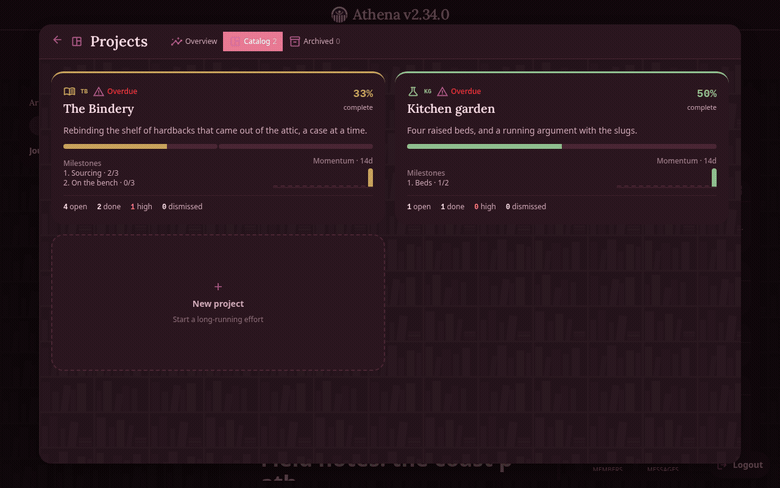
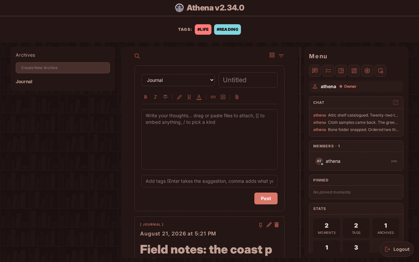
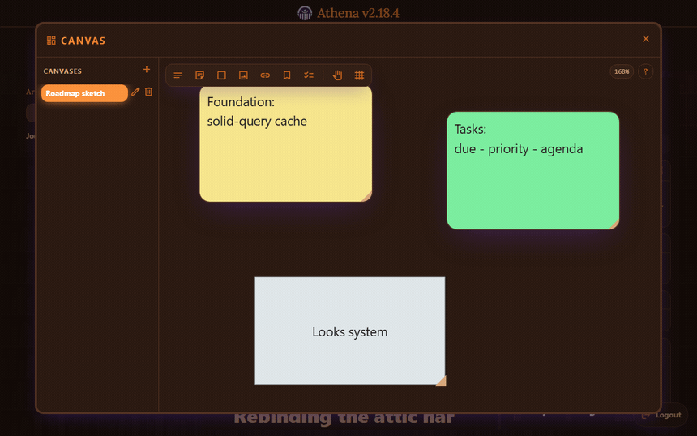
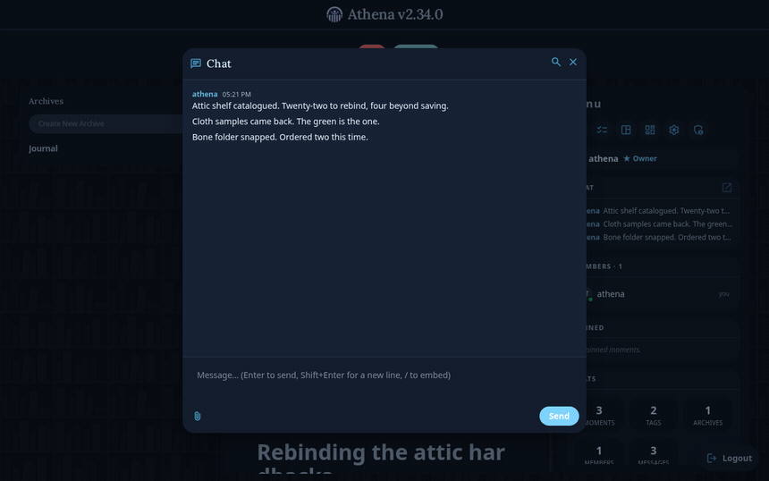
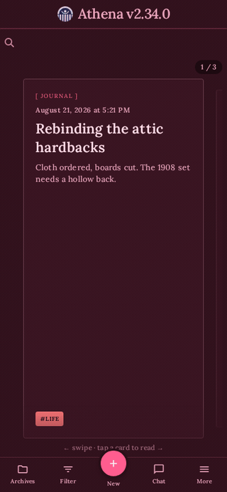

# Athena

 Athena is a self-hosted webapp that stores your notes, tasks, ideas, projects in a single unified interface that prioritizes accessibility, ease of use, and speed. Athena is designed to act as a universal solution to storing any kind of information. An optional electron client is available for desktop use that brings extended functionality like a library manager.


<sub>Legacy Theme</sub>

## Features

- **Moments.** Notes with a title, a Markdown body, colored tags, and file
  attachments (images, PDFs, audio, and video preview inline). Grouped into
  archives, with full-text search, filtering by date and media, pinning, and
  links between moments.
- **Tasks.** Lists with due dates, priorities, subtasks, recurring items, and a planner to visualize them.
- **Projects:** A dedicated workspace for projects, complete with a per-project and global-overview, timeline, documents, and a familiar interface.
- **Canva:** An infinite pan-and-zoom board joined by connectors. Text nodes
  are written the way moments are, markdown and live embeds included, and
  reference nodes render what they point at: a moment in full, a checkable todo
  list, a project's progress, another board's layout.
- **Chat:** A library-wide message log with the same formatting and embeds as moments.
- **Appearance:** Over then color themes and six visual presets that combine, both with editors for making your own.
- **Administration:** Users can be invited with links, and roles are available with permission control, as well a backup manager.
- **Clients:** An Athena instance can be accessed via a browser link, and a desktop app for
  Windows, macOS, and Linux.
- **Universal References:** One of the core features of Athena's unified interface is its ability to reference any kind of content, including moments, task lists, individual tasks, projects, and canvases in any markdown-supported text.

## What it looks like

Every clip below is the running app, one theme and look each, named underneath.

| Projects | Tasks and agenda |
| --- | --- |
| <br><sub>Rose theme, Slate-soft look</sub> | <br><sub>Ocean theme, Slate-soft look</sub> |

| Writing a moment | Canvas |
| --- | --- |
| <br><sub>Rosewood theme, Legacy look</sub> | <br><sub>Sunset theme, Aurora look</sub> |

| Chat | On a phone |
| --- | --- |
| <br><sub>Arctic theme, Slate-soft look</sub> | <br><sub>Valentine theme, Editorial look</sub> |

| Themes and looks |
| --- |
|  |
| The same feed under seven pairings. A theme sets the palette, a look sets surfaces, typography, and shape, and the two compose freely. |

Themes ship as Legacy, Dark, Light, Neutral, Rose, Valentine, Ocean, Royal
Blue, Sunset, Arctic, and Rosewood; looks as Legacy, Editorial, Glass, Ink,
Aurora, and Slate-soft. A custom theme exports as one shareable string, and a
theme can be pinned per archive. On a phone, moments read one at a time as
swipeable cards and a bottom nav replaces the tag bar and side menu with sheets.

## Self-hosting

Athena ships as one container: the Go server with the web client compiled into
it. Take [`docker-compose.yml`](docker-compose.yml) and start it:

```bash
docker compose up -d
```

Open `http://<host>:8080`. The compose file includes a Watchtower service that
checks hourly for a newer image and restarts into it, data untouched; delete it
to update by hand with `docker compose pull && docker compose up -d`. To run an
unreleased change, build from a checkout:

```bash
docker compose -f docker-compose.yml -f docker-compose.build.yml up -d --build
```

Athena serves plain HTTP and expects a proxy in front of it to terminate TLS.
Session cookies are `Secure` only when the Go server itself sees TLS, so behind
a terminating proxy they will not carry that flag; they stay `HttpOnly` with
`SameSite=Lax`. Forward the `Host` header so generated URLs stay correct.

### Data

Everything lives in `./data`, bind-mounted into the container. Back up that one
directory and you have backed up the library.

| Path | What it is |
| --- | --- |
| `data/athenaeum.db` | SQLite database: moments, tags, users, roles, chat |
| `data/uploads/` | Uploaded images, video, audio, and documents |
| `data/backups/` | Automated database snapshots |
| `data/athena.config.json` | Runtime settings written by the Settings UI |

### Configuration

All optional, and all shown at their defaults. Environment variables win over
what the Settings UI writes to `data/athena.config.json`.

| Variable | Default | Meaning |
| --- | --- | --- |
| `PORT` | `8080` | Port the server listens on |
| `SESSION_EXPIRY_DAYS` | `30` | Days a login stays valid. `0` never expires |
| `PRUNE_AFTER_DAYS` | `365` | Age at which soft-deleted content is purged |
| `BACKUP_INTERVAL` | `24h` | Go duration between backups. `0` disables them |
| `BACKUP_RETENTION` | `7` | How many backups to keep |
| `PREVIEW_CACHE_TTL_HOURS` | `168` | Hours a scraped link preview is cached |
| `MAX_UPLOAD_MB` | `50` | Largest single upload accepted |
| `DB_PATH` | `/app/data/athenaeum.db` | Database location |
| `UPLOADS_PATH` | `/app/data/uploads` | Upload directory |

## Development

A SolidJS PWA (TypeScript, Tailwind) served by a Go server with SQLite, plus an
Electron launcher. Auth is same-origin session cookies; live updates are
delta-sync polling.

```
athena/
├── server/     Go backend (HTTP API, SQLite, migrations, embedded PWA)
├── client/     SolidJS PWA (built into server/client/web and embedded)
├── shared/     OpenAPI spec and generated TypeScript types
├── electron/   Multi-server desktop launcher
└── docs/       Glossary, ADRs, and screenshots
```

Commands run from the repository root, which delegates into each sub-project.

| Command | Description |
| --- | --- |
| `npm run dev` | Full stack: Go API, client hot reload, and Electron |
| `npm run dev:web` | Client dev server only (open in a browser) |
| `npm run dev:server` | Go API only, on port 8080 |
| `npm run demo` | Wipe existing data and seed a full demo library |
| `npm run build` | Build the desktop installer with electron-builder |
| `npm run build:client` | Build the PWA into `server/client/web` |
| `npm run build:server` | `go build ./...` |
| `npm test` | Client unit tests and `go test ./...` |
| `npm run typecheck` | `tsc --noEmit` over the client |
| `npm run e2e` | Playwright end-to-end tests |
| `cd client && npm run screenshots` | Regenerate the README screenshots |
| `cd client && npm run demos` | Regenerate the README GIFs (needs ffmpeg) |

Two things to know before making changes:

- `vite build` writes the client into `server/client/web/`, which the Go binary
  embeds at compile time, so rebuild the server after building the client.
- Every image above comes from the running app.
  [`client/e2e/demos.spec.ts`](client/e2e/demos.spec.ts) starts a fresh server,
  seeds content over the API, films each surface under a different theme and
  look, and hands the frames to ffmpeg; its sibling
  [`screenshots.spec.ts`](client/e2e/screenshots.spec.ts) captures the stills.
  Change a pairing there and the caption here changes with it.

[`docs/GLOSSARY.md`](docs/GLOSSARY.md) has the domain glossary and
[`docs/adr/`](docs/adr) the architectural decisions.

## Security
To report a vulnerability, see [SECURITY.md](SECURITY.md).

## License

[AGPL-3.0-only](LICENSE). Athena is software you reach over a network, so the
Affero clause is the point: if you run a modified version and let other people
use it, they are entitled to your changes.
